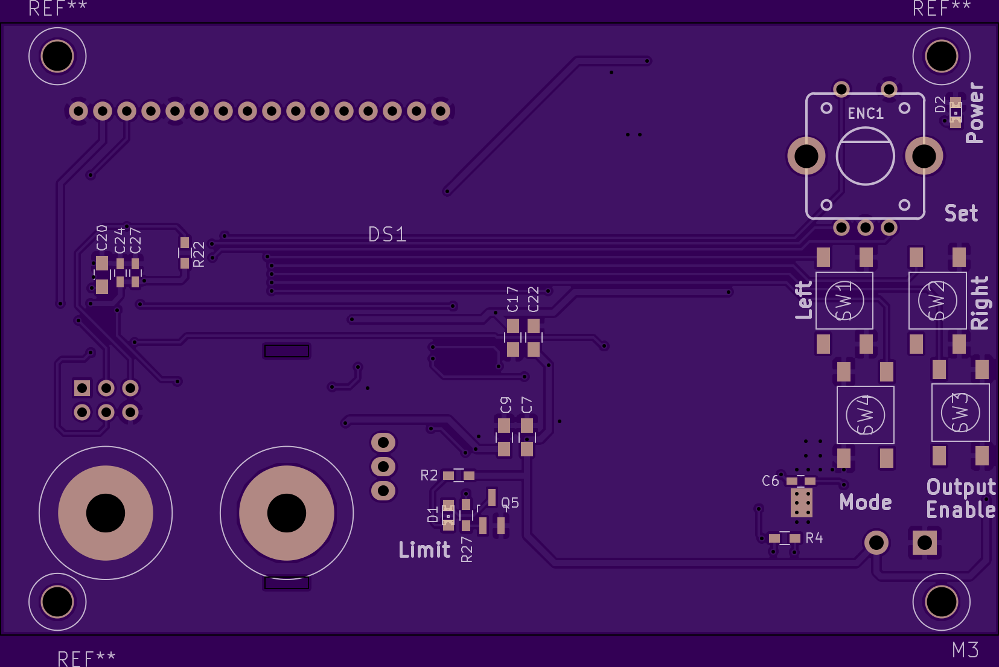
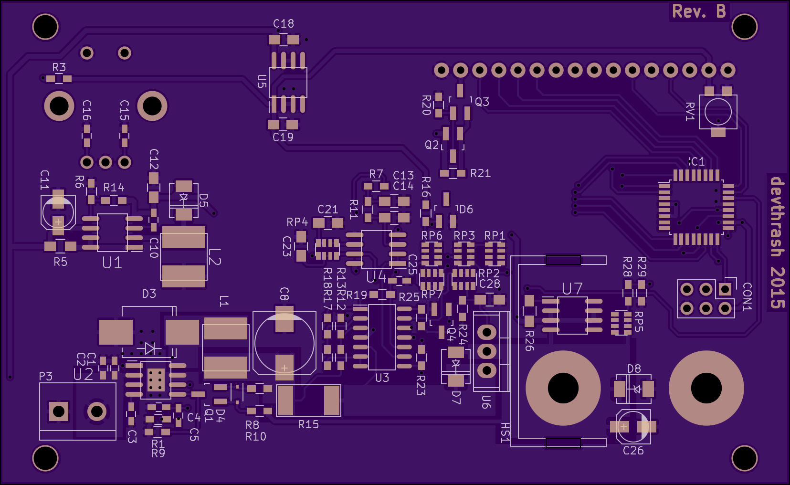

## ElbSupply - A simple linear bench supply

ElbSupply is a linear bench power supply with an output voltage range of 0-20V and output current range of 0-3A.

Here are the OSHpark renderings of the boards:

For project details visit the [project page on Hackaday.io](https://hackaday.io/project/4407-elbsupply-simple-linear-bench-supply)

 

